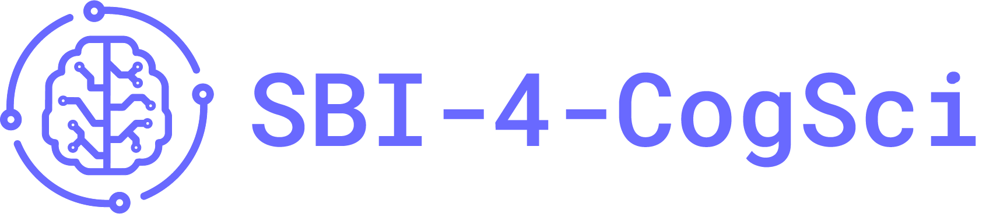

	

# SBI-4-CogSci Summer School Webpage

This repository contains the source files for the SBI-4-CogSci Summer School & [Workshop website](https://stefanradev93.github.io/sbi4cogsci/). All content, including the schedule, application information, organizers, venue details, and contact information, is managed here and built using [Quarto](https://quarto.org/).

Instructor adding a tutorial? See [`tutorials/CONTRIBUTING.md`](tutorials/CONTRIBUTING.md).

# Acknowledgements

We are grateful for the generous support of the [William K. and Katherine W. Estes Fund](https://www.psychonomic.org/page/estesfund), overseen by the Psychonomic Society and the Association for Psychological Science.
