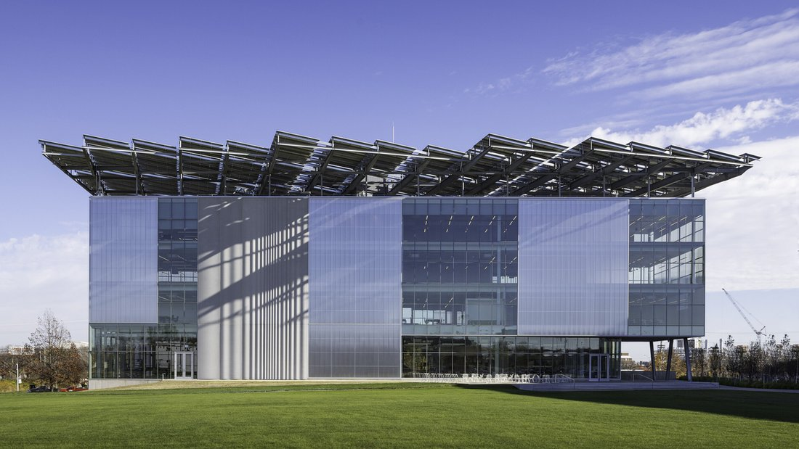
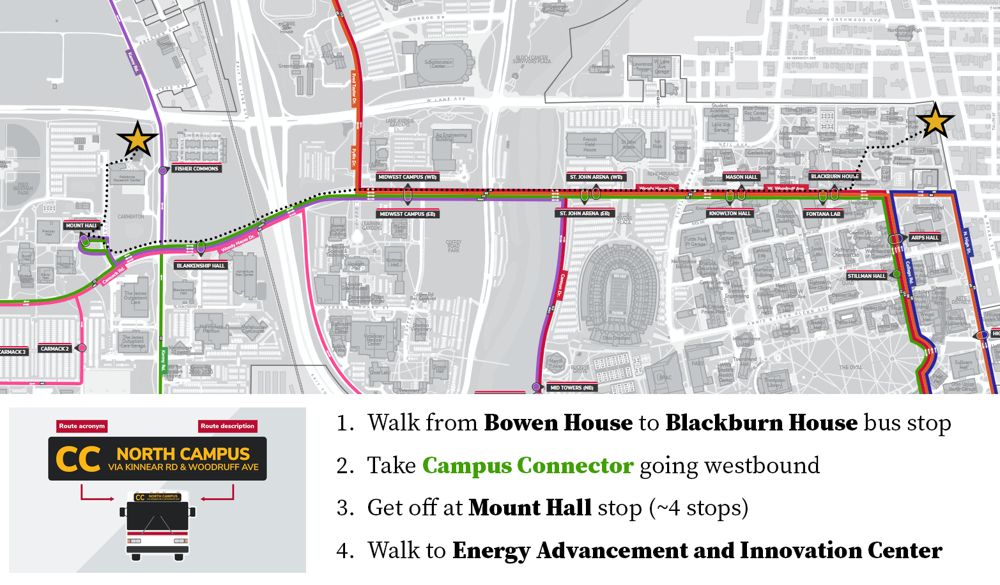
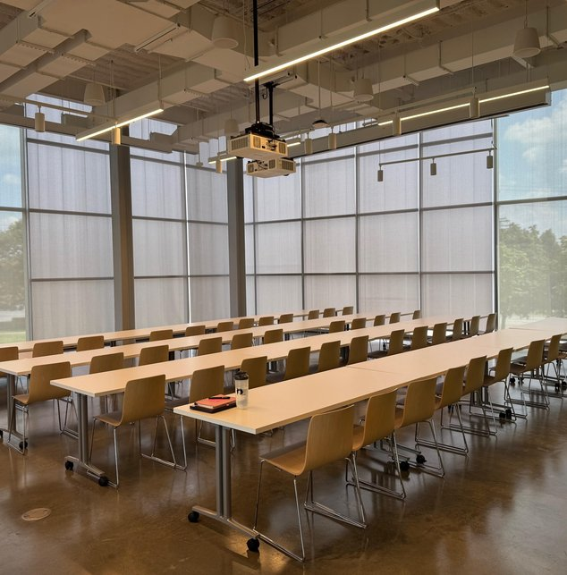
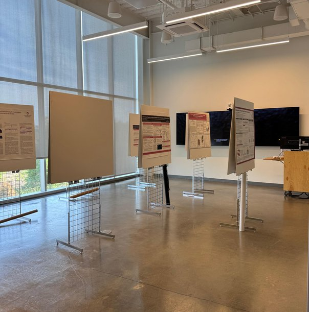
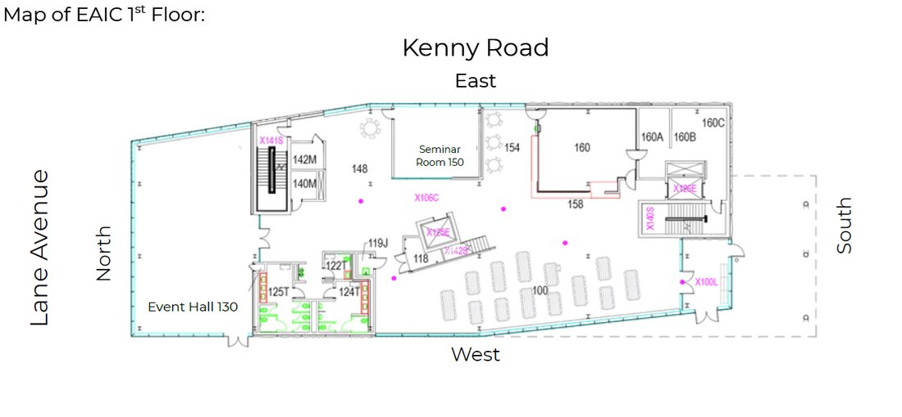

# Unlocking New Horizons in Cognitive Modeling with Simulation-Based Inference

**Summer School: July 27–31, 2026** — Energy Advancement and Innovation Center, The Ohio State University, Columbus, Ohio

*Applications are now closed. Accepted participants: see the venue and travel information below, and check your email for the pre-event survey and information booklet.*

## At a Glance

Modern simulation-based inference (SBI) represents a merger of deep learning and computational modeling, transforming how we think about, develop, fit, validate, and compare cognitive models. This summer school will introduce the basics of computational cognitive modeling and guide participants through the latest deep learning methods for supercharging their workflows. Participants will:

- Learn the basics of computational cognitive modeling
- Explore deep learning for cognitive science
- Apply modern SBI tools to real data
- Participate in hands-on demonstrations
- Discover new models using unsupervised learning
- Develop your own research project

## Venue & Getting There

The summer school takes place at the **Energy Advancement and Innovation Center (EAIC)**, 2281 Kenny Road, Columbus, OH 43210 — in OSU's Carmenton innovation district, easy to spot by its rooftop solar canopy. Lectures run in Event Hall 130, with breakouts in Seminar Room 150. Catered buffet lunch and all-day coffee & tea are provided on program days.

**Lodging:** participants stay at **Bowen House** (2125 N High Street), an OSU residence hall on north campus.

**Getting between Bowen House and the EAIC:** take the free CABS **Campus Connector (CC)** bus — board westbound at the Blackburn House stop on W. Woodruff Ave and get off at Mount Hall (~4 stops), then walk north to the EAIC. No ID or pass is needed; track buses in the [Ohio State app](https://www.osu.edu/osumobile).

**Flying in:** John Glenn Columbus International Airport (CMH) is 20–25 minutes from campus by rideshare or taxi.

Useful links: [How to ride CABS](https://ttm.osu.edu/how-ride-cabs) · [CABS system map](https://ttm.osu.edu/sites/default/files/documents/cabs-system-map.pdf) · [Columbus neighborhoods](https://offcampus.osu.edu/resources/community-resources/columbus-neighborhoods) · [OSU public safety](https://dps.osu.edu/) · [Self-guided campus tour](https://campusvisit.osu.edu/self-guided.pdf)

::: {layout-ncol=3}

:::

## Summer School Themes

::::::::: grid-3
::: theme-card

{width=80}

[**Cognitive Modeling**](https://psycnet.apa.org/fulltext/2026-03980-001){.theme-title target="_blank"}

Learn how computational models are used to explain cognitive processes. Understand the principles behind model construction and validation.
:::

::: theme-card
{width=80}

[**Bayesian Analysis**](https://arxiv.org/abs/1904.12765){.theme-title target="_blank"}

Explore Bayesian methods for parameter estimation and model comparison. Learn how to quantify, interpret, and embrace uncertainty.
:::

::: theme-card
{width=80}

[**Simulation-Based Inference**](https://www.pnas.org/doi/10.1073/pnas.1912789117){.theme-title target="_blank"}

Discover how SBI leverages simulations and deep learning to fit complex models that are otherwise intractable. Apply SBI to model real behavioral data.
:::

::: theme-card
{width=80}

[**Joint Modeling**](https://www.sciencedirect.com/science/article/abs/pii/S0022249617301335){.theme-title target="_blank"}

Integrate multiple data sources or behavioral tasks into unified models. Joint modeling enables richer inferences and more robust predictions.
:::

::: theme-card
{width=80}

[**Dynamic Modeling**](https://www.cell.com/trends/cognitive-sciences/abstract/S1364-6613(25)00149-4){.theme-title target="_blank"}

Model cognitive processes that unfold over time. Dynamic models capture the complex temporal structure of behavior and cognition.
:::

::: theme-card
{width=80}

[**Model Discovery**](https://www.pnas.org/doi/10.1073/pnas.2401238121){.theme-title target="_blank"}

Leverage unsupervised learning to extract new models directly from data. Compare general neural models to task-performing models.
:::
:::::::::

## Sponsors

This summer school is generously sponsored by the [William K. and Katherine W. Estes Fund](https://www.psychonomic.org/page/estesfund) overseen by the Psychonomic Society and the Association for Psychological Science. The organizers acknowledge support from the National Science Foundation and The Ohio State College of Arts & Sciences.
