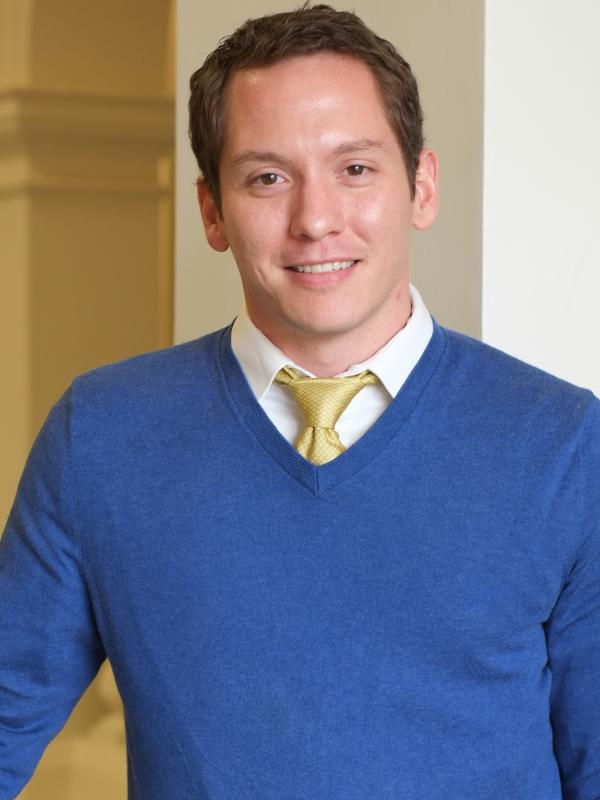
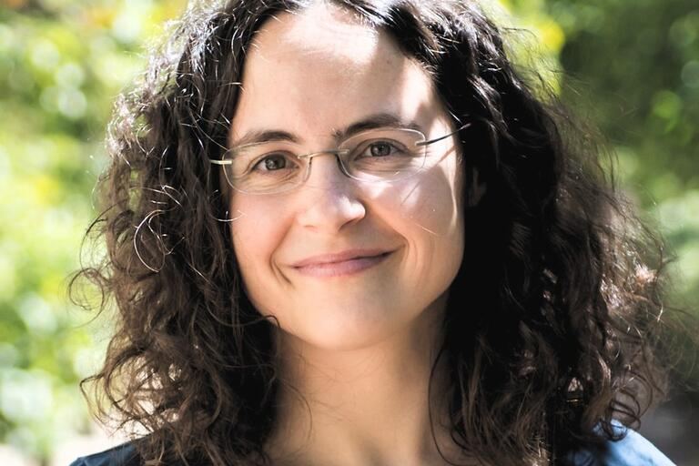
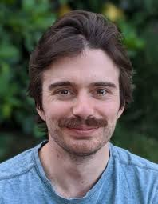
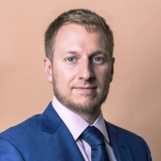
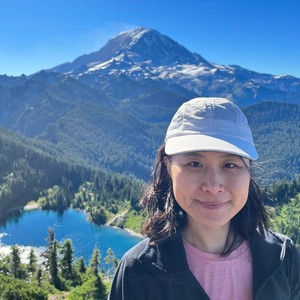

# Organizers

::: {.grid}

::: {.g-col-12 .g-col-md-6}

### [Peter Kvam](https://peterkvam.com)

The Ohio State University

Peter Kvam is an Associate Professor of Psychology at The Ohio State University, where he directs the Cognition & Decision Modeling Lab. His research spans judgment and decision-making, multi-alternative and continuous choice, and machine learning / AI methods for fitting, comparing, and discovering cognitive models.
:::

::: {.g-col-12 .g-col-md-6}

### [Brandon Turner](https://turner-mbcn.com)

The Ohio State University

Brandon Turner is a Professor of Psychology at The Ohio State University. His research develops dynamic models of cognition and perceptual decision-making, efficient methods for likelihood-free and likelihood-informed Bayesian inference, and ways of unifying behavioral and neural explanations of cognition.
:::

::: {.g-col-12 .g-col-md-6}

### [Stefan T. Radev](https://bayesops.com)

Rensselaer Polytechnic Institute

Stefan Radev is an Assistant Professor of Cognitive Science at Rensselaer Polytechnic Institute, where he leads the BayesOps Lab. His research develops new Bayesian methods powered by generative AI alongside computational models of complex systems — two streams that converge in BayesFlow, the open-source library for amortized Bayesian inference with modern deep learning.
:::

::: {.g-col-12 .g-col-md-6}

### [Anne Collins](https://ccn.studentorg.berkeley.edu)

University of California, Berkeley

Anne Collins is an Associate Professor of Psychology at UC Berkeley and a member of the Helen Wills Neuroscience Institute, where she directs the Computational Cognitive Neuroscience (CCN) Lab. Her research combines computational modeling, behavior, and neuroscience to understand how learning, reinforcement learning, and working memory interact to produce flexible human behavior.
:::

::: {.g-col-12 .g-col-md-6}

### [Michael Nunez](https://www.michaeldnunez.com)

University of Amsterdam

Michael D. Nunez is an Associate Professor in the Psychological Methods group at the University of Amsterdam, where he leads the Mathematical Cognitive Neuroscience Laboratory. He builds mathematical models of decision-making that are tested against joint recordings of behavior and brain electrophysiology (EEG), and works on improving the statistical methods used to fit these models to data.
:::

::: {.g-col-12 .g-col-md-6}

### [Konstantina Sokratous](https://www.lazyneuron.com)

University of Missouri

Konstantina Sokratous is a Postdoctoral Fellow at the University of Missouri specializing in cognitive science, AI, computational modeling, and Bayesian methods. Her work develops neural-network tools for fitting and comparing models of decision behavior, including deep-learning approaches for estimating preferences from choices and willingness-to-pay prices.
:::

::: {.g-col-12 .g-col-md-6}

### [Alexander Fengler](https://alexanderfengler.github.io)

Brown University

Alex Fengler is a postdoctoral researcher at Brown University's Carney Institute for Brain Science, with a background spanning business, neuroeconomics, statistics, and cognitive science. He drives the main line of research on simulation-based inference for cognitive process models — including likelihood-approximation networks and the HSSM toolbox — and works as a Principal Data Scientist at PyMC Labs.
:::

::: {.g-col-12 .g-col-md-6}

### [Ti-Fen Pan](https://ccn.studentorg.berkeley.edu/pages/people.html)

University of California, Berkeley

Ti-Fen Pan is a PhD researcher in the Computational Cognitive Neuroscience Lab at UC Berkeley. After an MSc in Electrical and Computer Engineering at Carnegie Mellon and several years as a software engineer, she now studies individual differences in learning, developing neural-network methods that identify time-varying latent variables in cognitive models.
:::

::: {.g-col-12 .g-col-md-6}

### [Benson Zhao](https://peterkvam.com)

The Ohio State University

Bingsong (Benson) Zhao is a doctoral student in psychology at The Ohio State University, having received a B.S. in Economics and an M.S. in Psychology from Sun Yat-sen University. He studies the computational and neural mechanisms of decision-making, information seeking, and learning, along with related individual and cultural differences.
:::

:::
